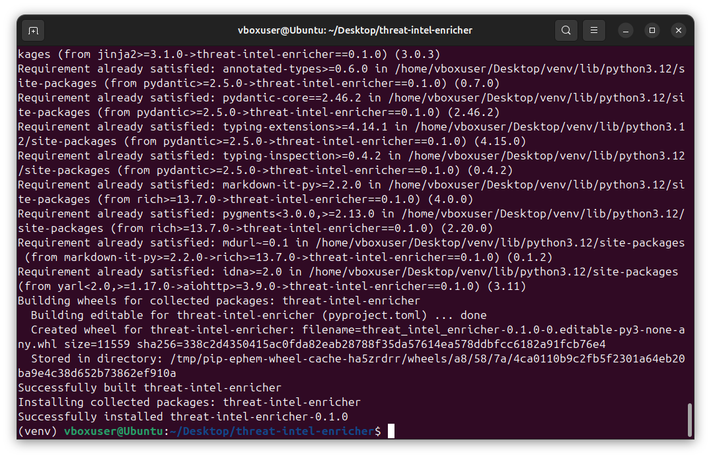
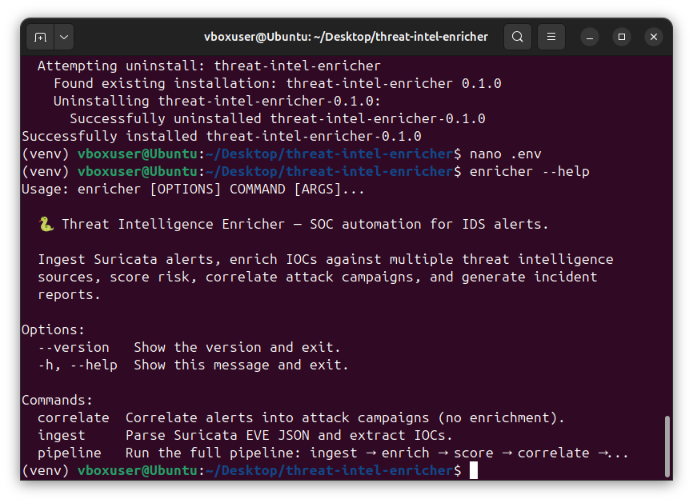
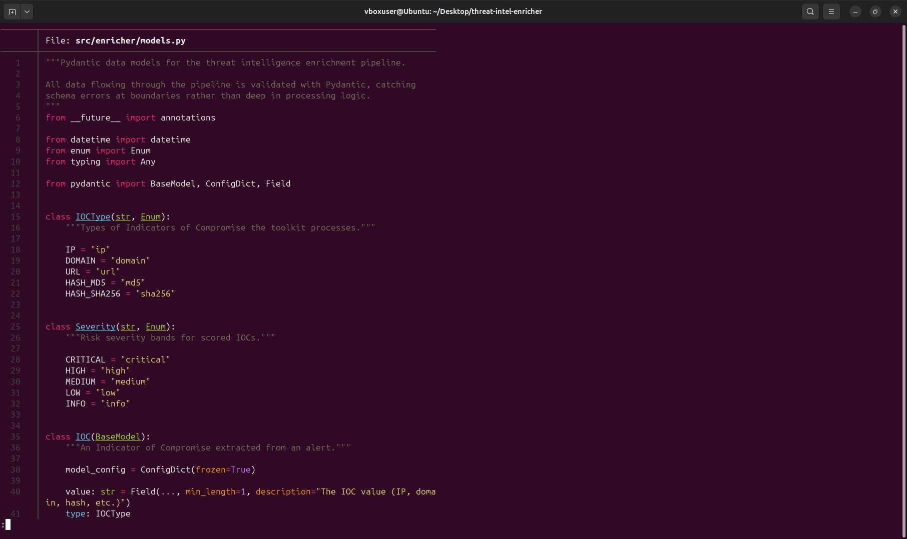
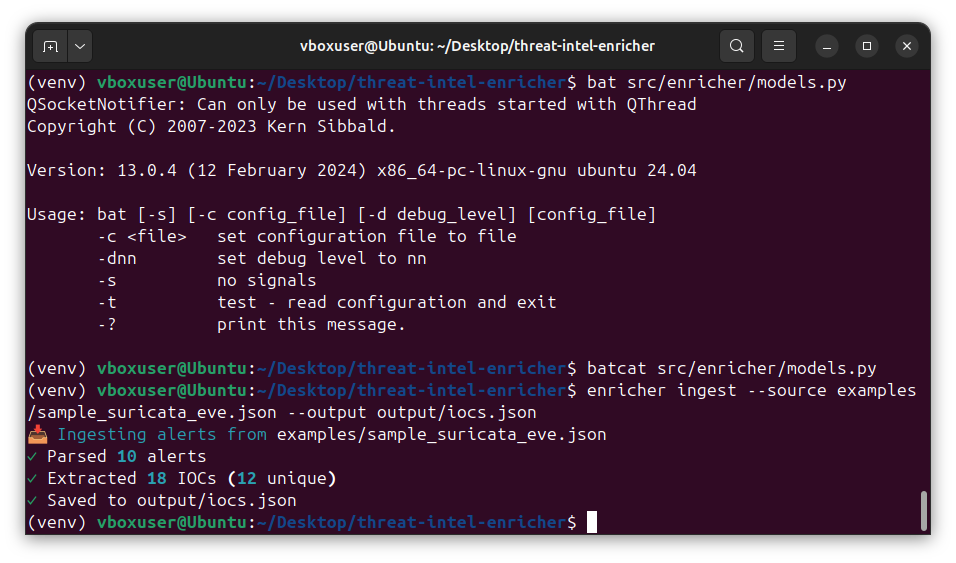
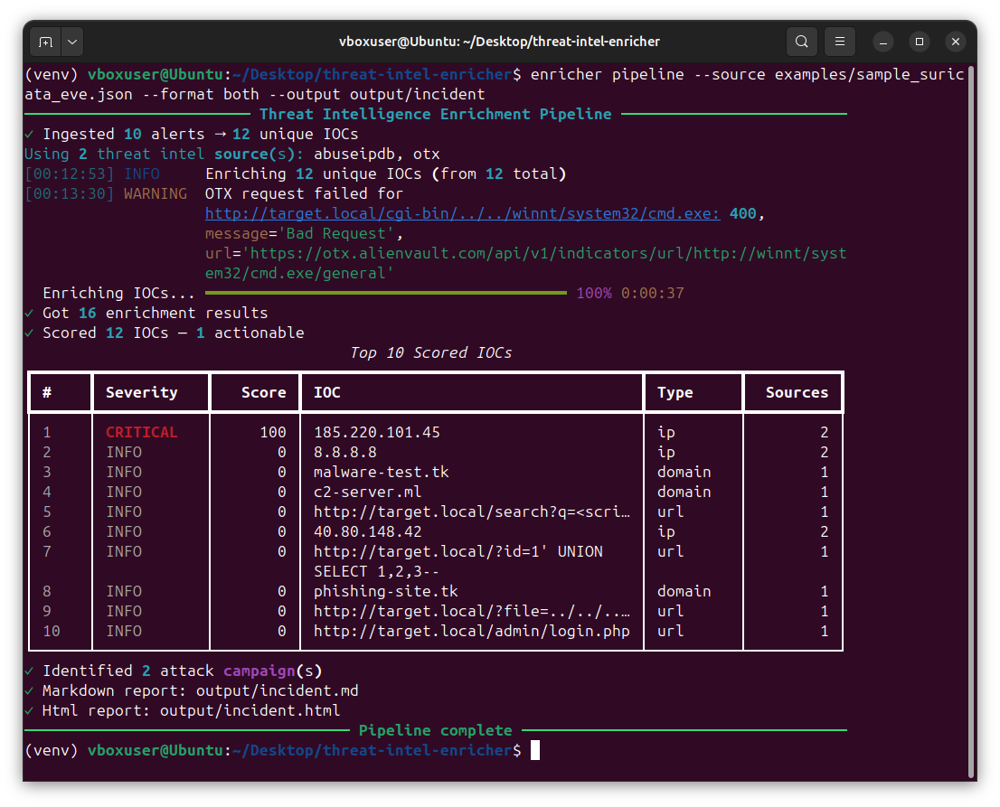
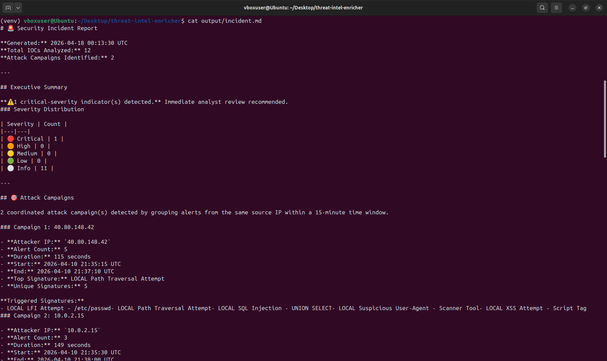
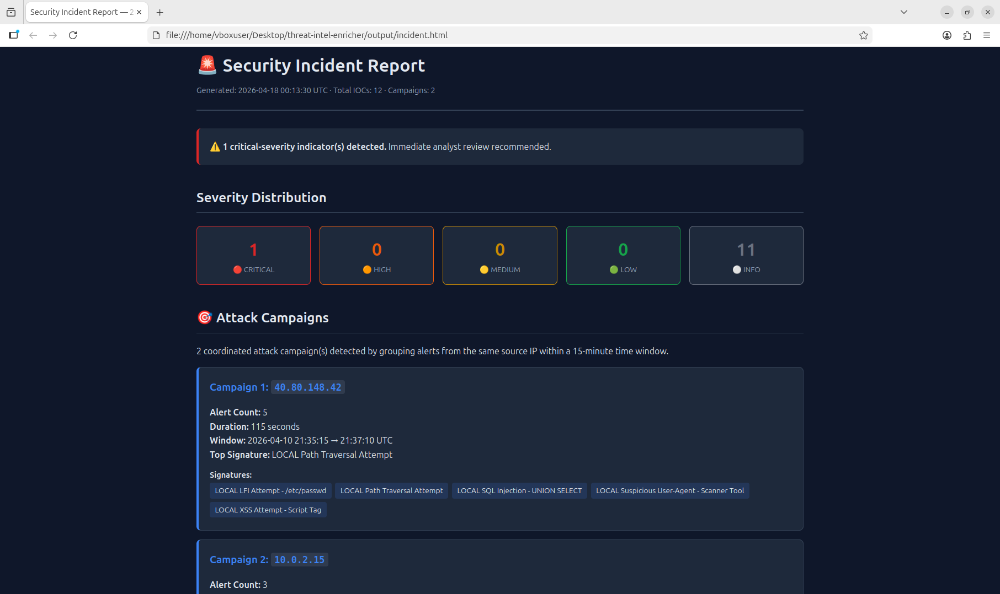
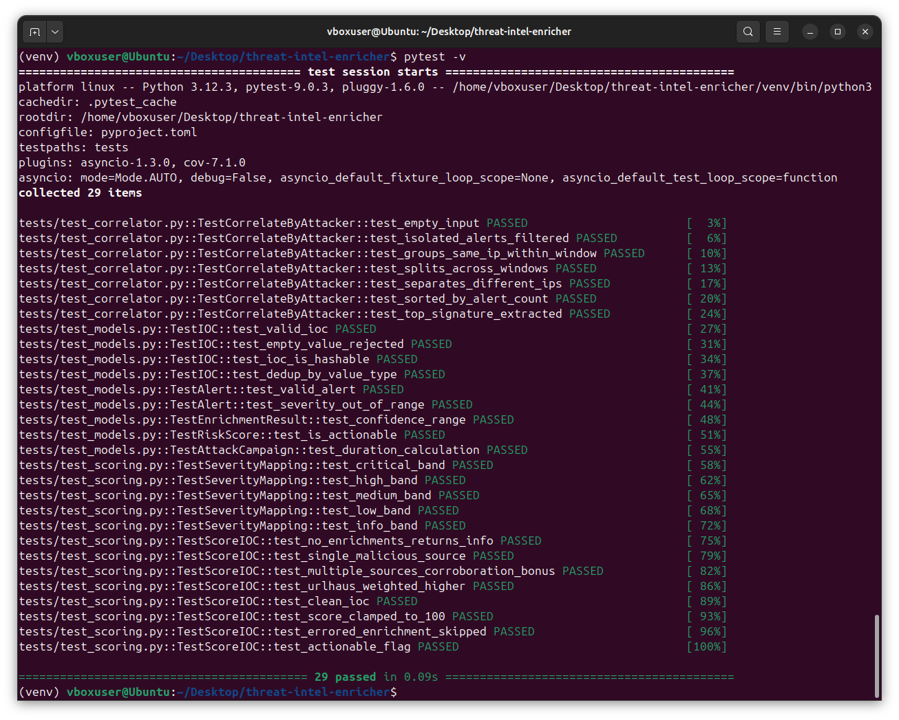

<div align="center">

# 🐍 Threat Intelligence Enricher & Alert Triage Pipeline

### Python-Powered SOC Automation — From Raw IDS Alerts to Enriched Intelligence Reports

[](https://www.python.org/)
[](https://docs.python.org/3/library/asyncio.html)
[](https://docs.pydantic.dev/)
[](https://pytest.org/)
[](LICENSE)

<br>

*A production-style Python toolkit that ingests Suricata IDS alerts, extracts indicators of compromise, concurrently enriches them against multiple threat intelligence sources (AbuseIPDB, URLhaus, AlienVault OTX), scores risk using a weighted multi-source algorithm, correlates related alerts into attack campaigns, and generates analyst-ready incident reports in Markdown and HTML.*

<br>

[Setup](#part-1---installation--project-setup) · [Architecture](#part-2---architecture--design-patterns) · [Ingestion](#part-3---alert-ingestion--ioc-extraction) · [Enrichment](#part-4---multi-source-threat-intelligence-enrichment) · [Scoring](#part-5---risk-scoring--alert-correlation) · [Reporting](#part-6---report-generation--siem-integration)

</div>

---

## 📋 Project Overview

A modern Security Operations Center doesn't just generate alerts — it **enriches** them. Raw IDS alerts tell you *what* happened, but analysts need context: Is this IP known-malicious? Has this domain been seen in other campaigns? How does this alert relate to others in the same time window? **Threat intelligence enrichment** answers these questions, and automation is the only way to do it at scale.

This project is the automation layer that sits on top of the [Suricata IDS Rules project](https://github.com/jesse12-21/suricata-ids-rules) — taking raw EVE JSON alerts, extracting IOCs, querying multiple threat intelligence sources concurrently, scoring risk, and producing the kind of enriched incident reports that analysts actually use. It demonstrates production Python patterns employers look for: async concurrency, Pydantic data validation, abstract base classes for extensibility, comprehensive CLI design with Rich terminal output, and test coverage.

### What This Project Covers

| Section | Skill Demonstrated | Technologies |
|---|---|---|
| **Setup & Project Structure** | Modern Python packaging, virtual environments, secrets management | `pyproject.toml`, `venv`, `python-dotenv` |
| **Architecture & Design** | Object-oriented design, abstract base classes, separation of concerns | ABCs, Pydantic models, strategy pattern |
| **Alert Ingestion** | Parsing JSON streams, data normalization, IOC extraction | `json`, regex, Pydantic |
| **Concurrent Enrichment** | Async I/O, rate limiting, API integration, error handling | `asyncio`, `aiohttp`, retry logic |
| **Risk Scoring** | Weighted scoring algorithms, confidence calculation | NumPy-style logic, custom algorithms |
| **Report Generation** | Template-driven output, multi-format reporting | Jinja2, Markdown, HTML |

### Sample Run Results

Running the full pipeline against the included `examples/sample_suricata_eve.json`:

| Metric | Value |
|---|---|
| Alerts ingested | **10** |
| IOCs extracted → deduplicated | **18 → 12 unique** |
| Active threat intel sources | **2** (AbuseIPDB, OTX) |
| Enrichment results collected | **16** across 12 IOCs |
| Actionable (score ≥ 80) findings | **1** — `185.220.101.45` scored **CRITICAL / 100** (Tor exit node, flagged by multiple sources) |
| Attack campaigns correlated | **2** — `40.80.148.42` (5 alerts, 115 s, 5 distinct signatures) and `10.0.2.15` (3 alerts, 149 s) |
| Total wall-clock time | **~37 s** (concurrent async enrichment) |
| Test suite | **29 pytest tests, 0.09 s** |

---

## 🏗️ Architecture

The toolkit implements a classic ETL pipeline pattern: **Extract → Enrich → Load** — specialized for security operations.

### Data Flow

```
+--------------------------------------------------------------------+
|                  Threat Intel Enrichment Pipeline                  |
|                                                                    |
|   +-------------------+      +----------------------+              |
|   |  Suricata Alerts  |      |   IOC Extractor      |              |
|   |  (EVE JSON)       | ---> |   (IPs, domains,     |              |
|   |                   |      |    hashes, URLs)     |              |
|   +-------------------+      +----------+-----------+              |
|                                         |                          |
|                                         v                          |
|                    +----------------------------------+            |
|                    |    Concurrent Enricher (async)   |            |
|                    |                                  |            |
|                    |  +------------+  +-------------+ |            |
|                    |  | AbuseIPDB  |  |   URLhaus   | |            |
|                    |  +------------+  +-------------+ |            |
|                    |  +------------+                  |            |
|                    |  | AlienVault |  ... more        |            |
|                    |  |    OTX     |                  |            |
|                    |  +------------+                  |            |
|                    +-----------------+----------------+            |
|                                      |                             |
|                                      v                             |
|                    +----------------------------------+            |
|                    |       Risk Scoring Engine        |            |
|                    |     (weighted multi-source)      |            |
|                    +-----------------+----------------+            |
|                                      |                             |
|                                      v                             |
|                    +----------------------------------+            |
|                    |         Alert Correlator         |            |
|                    |   (group by campaign/attacker)   |            |
|                    +-----------------+----------------+            |
|                                      |                             |
|                                      v                             |
|                    +----------------------------------+            |
|                    |         Report Generator         |            |
|                    |  +--------+  +-------+  +------+ |            |
|                    |  |  JSON  |  |  MD   |  | HTML | |            |
|                    |  +--------+  +-------+  +------+ |            |
|                    +----------------------------------+            |
+--------------------------------------------------------------------+
```

### Project Structure

```
threat-intel-enricher/
├── src/enricher/
│   ├── cli.py                    # Click-based CLI with Rich output
│   ├── config.py                 # Settings and secrets management
│   ├── models.py                 # Pydantic data models
│   ├── scoring.py                # Risk scoring algorithms
│   ├── correlator.py             # Alert correlation logic
│   ├── ingesters/
│   │   ├── base.py               # Abstract ingester interface
│   │   └── suricata.py           # Suricata EVE JSON parser
│   ├── enrichers/
│   │   ├── base.py               # Abstract enricher interface
│   │   ├── abuseipdb.py          # AbuseIPDB API client
│   │   ├── urlhaus.py            # URLhaus API client (no key)
│   │   └── otx.py                # AlienVault OTX client
│   └── reporters/
│       ├── base.py               # Abstract reporter interface
│       ├── markdown_reporter.py  # Jinja2 Markdown generator
│       └── html_reporter.py      # Jinja2 HTML generator
├── tests/                        # pytest test suite
├── examples/                     # Sample inputs and outputs
├── pyproject.toml                # Modern Python packaging
└── requirements.txt              # Dependency lock
```

---

## Part 1 - Installation & Project Setup

### Prerequisites

- **Python 3.12** (for modern async syntax and type hints — tested on 3.12.3)
- **Git**
- API keys (free tiers work):
  - [AbuseIPDB](https://www.abuseipdb.com/api) — IP reputation
  - [AlienVault OTX](https://otx.alienvault.com/api) — Community threat intel

URLhaus does not require an API key.

### Setup

```bash
# Clone the repository
git clone https://github.com/YOUR_USERNAME/threat-intel-enricher.git
cd threat-intel-enricher

# Create and activate a virtual environment
python3 -m venv venv
source venv/bin/activate        # Linux/macOS
# venv\Scripts\activate          # Windows

# Install dependencies
pip install -r requirements.txt

# Install the package in editable mode
pip install -e .
```

### Configuration

The toolkit uses a `.env` file for secrets. Copy the template and add your API keys:

```bash
cp .env.example .env
nano .env
```

`.env` contents:

```bash
# AbuseIPDB API key (https://www.abuseipdb.com/account/api)
ABUSEIPDB_API_KEY=your_key_here

# AlienVault OTX API key (https://otx.alienvault.com/api)
OTX_API_KEY=your_key_here

# Optional: rate limiting
ENRICHER_MAX_CONCURRENT_REQUESTS=10
ENRICHER_REQUEST_TIMEOUT=30
```

<div align="center">

<br><em>Clean editable installation (<code>threat-intel-enricher 0.1.0</code>) inside an isolated Python 3.12 virtual environment — all dependencies (pydantic, aiohttp, rich, jinja2) resolved and the <code>enricher</code> command registered as a console script</em>
</div>

<br>

### Verifying the Installation

```bash
enricher --help
```

<div align="center">

<br><em>Rich-powered CLI exposing three composable commands — <code>ingest</code> (parse EVE JSON and extract IOCs), <code>correlate</code> (group alerts into attack campaigns without enrichment), and <code>pipeline</code> (end-to-end ingest → enrich → score → correlate → report)</em>
</div>

<br>

---

## Part 2 - Architecture & Design Patterns

### Abstract Base Classes for Extensibility

The toolkit uses Python's **Abstract Base Class (ABC)** pattern to make every pipeline stage pluggable. Want to add a new threat intel source? Implement `BaseEnricher`. Want to support a new input format? Implement `BaseIngester`. This is the same pattern used by production SOAR platforms.

```python
# src/enricher/enrichers/base.py
from abc import ABC, abstractmethod
from typing import Optional
from enricher.models import IOC, EnrichmentResult


class BaseEnricher(ABC):
    """Abstract base class for threat intelligence enrichers.
    
    All enrichers must implement enrich() to query their backing
    service and return a standardized EnrichmentResult.
    """
    
    name: str
    supported_ioc_types: list[str]
    
    @abstractmethod
    async def enrich(self, ioc: IOC) -> Optional[EnrichmentResult]:
        """Query this source for information about the given IOC.
        
        Returns None if the IOC type is unsupported or no data found.
        Raises EnrichmentError on unrecoverable API failures.
        """
        ...
    
    def supports(self, ioc: IOC) -> bool:
        """Check if this enricher can process the given IOC type."""
        return ioc.type in self.supported_ioc_types
```

### Pydantic Data Models

All data flowing through the pipeline is validated with Pydantic v2 — catching schema errors at the boundary rather than deep in processing logic:

```python
# src/enricher/models.py
"""Pydantic data models for the threat intelligence enrichment pipeline.

All data flowing through the pipeline is validated with Pydantic, catching
schema errors at boundaries rather than deep in processing logic.
"""
from __future__ import annotations

from datetime import datetime
from enum import Enum
from typing import Any

from pydantic import BaseModel, ConfigDict, Field


class IOCType(str, Enum):
    """Types of Indicators of Compromise the toolkit processes."""

    IP = "ip"
    DOMAIN = "domain"
    URL = "url"
    HASH_MD5 = "md5"
    HASH_SHA256 = "sha256"


class Severity(str, Enum):
    """Risk severity bands for scored IOCs."""

    CRITICAL = "critical"
    HIGH = "high"
    MEDIUM = "medium"
    LOW = "low"
    INFO = "info"


class IOC(BaseModel):
    """An Indicator of Compromise extracted from an alert."""

    model_config = ConfigDict(frozen=True)

    value: str = Field(..., min_length=1, description="The IOC value (IP, domain, hash, etc.)")
    type: IOCType
    first_seen: datetime
    source_alert_id: str


class EnrichmentResult(BaseModel):
    """Standardized output from any threat intel source."""
    ioc: IOC
    source: str
    malicious: bool
    confidence: float = Field(ge=0.0, le=1.0)
    categories: list[str] = []
    last_seen: datetime | None = None
    reference_url: str | None = None
    raw_response: dict[str, Any] = {}


class RiskScore(BaseModel):
    """Aggregated risk score for an IOC across all sources."""
    ioc: IOC
    score: int = Field(ge=0, le=100)
    severity: Severity
    sources_reporting: int
    enrichments: list[EnrichmentResult]
```

### Async Concurrency for API Calls

Querying 5 threat intel APIs sequentially takes 5+ seconds per IOC. Concurrent async execution reduces this to the time of the slowest single API — typically under a second:

```python
# Simplified from src/enricher/pipeline.py
async def enrich_all(ioc: IOC, enrichers: list[BaseEnricher]):
    """Query all applicable enrichers concurrently."""
    tasks = [
        enricher.enrich(ioc) 
        for enricher in enrichers 
        if enricher.supports(ioc)
    ]
    results = await asyncio.gather(*tasks, return_exceptions=True)
    return [r for r in results if isinstance(r, EnrichmentResult)]
```

<div align="center">

<br><em><code>src/enricher/models.py</code> — frozen Pydantic <code>IOC</code> models (hashable for set-based deduplication), <code>IOCType</code> and <code>Severity</code> enums for type-safe comparisons, and <code>from __future__ import annotations</code> for forward references. Validation at the boundary means downstream code can trust the data</em>
</div>

<br>

---

## Part 3 - Alert Ingestion & IOC Extraction

### Parsing Suricata EVE JSON

Suricata's EVE JSON format is line-delimited JSON — each line is a separate event. The ingester streams the file, filters for alert events, and extracts indicators:

```python
# src/enricher/ingesters/suricata.py
from pathlib import Path
from typing import Iterator
from enricher.models import Alert, IOC, IOCType


class SuricataIngester(BaseIngester):
    name = "suricata_eve"
    
    def ingest(self, source: Path) -> Iterator[Alert]:
        """Stream alerts from a Suricata EVE JSON file."""
        with source.open() as f:
            for line_num, line in enumerate(f, 1):
                try:
                    event = json.loads(line)
                    if event.get("event_type") != "alert":
                        continue
                    yield self._parse_alert(event)
                except json.JSONDecodeError as e:
                    logger.warning(f"Skipping malformed line {line_num}: {e}")
    
    def extract_iocs(self, alert: Alert) -> list[IOC]:
        """Extract IP, domain, and URL IOCs from an alert."""
        iocs = []
        
        # Source IP is always present
        iocs.append(IOC(
            value=alert.src_ip,
            type=IOCType.IP,
            first_seen=alert.timestamp,
            source_alert_id=alert.id
        ))
        
        # DNS queries contain domain IOCs
        if alert.dns and alert.dns.rrname:
            iocs.append(IOC(
                value=alert.dns.rrname,
                type=IOCType.DOMAIN,
                first_seen=alert.timestamp,
                source_alert_id=alert.id
            ))
        
        # HTTP traffic contains URL IOCs  
        if alert.http and alert.http.hostname:
            iocs.append(IOC(
                value=f"http://{alert.http.hostname}{alert.http.url}",
                type=IOCType.URL,
                first_seen=alert.timestamp,
                source_alert_id=alert.id
            ))
        
        return iocs
```

### Running the Ingester

```bash
enricher ingest --source examples/sample_suricata_eve.json --output output/iocs.json
```

<div align="center">

<br><em>Streaming the sample Suricata EVE file through the ingester — <strong>10 alerts parsed</strong>, <strong>18 IOCs extracted</strong>, deduplicated down to <strong>12 unique indicators</strong> ready for enrichment. Per-alert extraction pulls source IPs, DNS queries, and HTTP URL IOCs; the set-based dedup removes the ~33% redundancy typical of scan-style traffic</em>
</div>

<br>

---

## Part 4 - Multi-Source Threat Intelligence Enrichment

### Concurrent API Integration

Each threat intel source is implemented as a `BaseEnricher` subclass. The pipeline orchestrates them concurrently with `asyncio.gather()`, handling rate limits and retries transparently.

**AbuseIPDB — IP reputation:**

```python
# src/enricher/enrichers/abuseipdb.py
class AbuseIPDBEnricher(BaseEnricher):
    name = "abuseipdb"
    supported_ioc_types = [IOCType.IP]
    
    def __init__(self, api_key: str, session: aiohttp.ClientSession):
        self.api_key = api_key
        self.session = session
    
    async def enrich(self, ioc: IOC) -> EnrichmentResult | None:
        async with self.session.get(
            "https://api.abuseipdb.com/api/v2/check",
            params={"ipAddress": ioc.value, "maxAgeInDays": 90},
            headers={"Key": self.api_key, "Accept": "application/json"}
        ) as response:
            if response.status == 429:
                raise RateLimitError("AbuseIPDB rate limit hit")
            data = await response.json()
        
        confidence_score = data["data"]["abuseConfidenceScore"]
        return EnrichmentResult(
            ioc=ioc,
            source=self.name,
            malicious=confidence_score >= 25,
            confidence=confidence_score / 100.0,
            categories=data["data"].get("categoriesDescription", []),
            reference_url=f"https://www.abuseipdb.com/check/{ioc.value}",
            raw_response=data["data"]
        )
```

**URLhaus — malicious URL database (no API key required):**

```python
# src/enricher/enrichers/urlhaus.py
class URLhausEnricher(BaseEnricher):
    name = "urlhaus"
    supported_ioc_types = [IOCType.URL, IOCType.DOMAIN]
    
    async def enrich(self, ioc: IOC) -> EnrichmentResult | None:
        endpoint = "host" if ioc.type == IOCType.DOMAIN else "url"
        async with self.session.post(
            f"https://urlhaus-api.abuse.ch/v1/{endpoint}/",
            data={endpoint: ioc.value}
        ) as response:
            data = await response.json()
        
        if data["query_status"] != "ok":
            return None
        
        return EnrichmentResult(
            ioc=ioc,
            source=self.name,
            malicious=True,  # URLhaus only lists confirmed malicious
            confidence=1.0,
            categories=data.get("tags", []),
            last_seen=parse_datetime(data.get("date_added")),
            reference_url=data.get("urlhaus_reference"),
            raw_response=data
        )
```

### Running Enrichment

The full pipeline handles ingestion, enrichment, scoring, correlation, and reporting in a single command:

```bash
enricher pipeline \
  --source examples/sample_suricata_eve.json \
  --format both \
  --output output/incident
```

<div align="center">

<br><em>End-to-end pipeline run against the sample EVE file — 12 unique IOCs enriched concurrently against 2 active sources (<code>abuseipdb</code>, <code>otx</code>) producing <strong>16 enrichment results in 37 seconds</strong>. Note the graceful WARNING on a malformed OTX URL (HTTP 400) — one bad IOC doesn't abort the batch thanks to <code>asyncio.gather(..., return_exceptions=True)</code>. Rich progress bars render live while async tasks complete</em>
</div>

<br>

### Supported Threat Intel Sources

| Source | IOC Types | API Key Required | Rate Limit (Free) |
|---|---|---|---|
| **AbuseIPDB** | IPv4 | Yes | 1,000/day |
| **URLhaus** (abuse.ch) | URLs, domains | No | Reasonable use |
| **AlienVault OTX** | IPs, domains, URLs, hashes | Yes | 10,000/hour |
| **Extensible** | Add your own | — | Implement `BaseEnricher` |

---

## Part 5 - Risk Scoring & Alert Correlation

### Weighted Multi-Source Risk Scoring

A single source saying "this IP is malicious" is useful. **Three sources** saying so is far more compelling. The scoring engine aggregates enrichment results into a single risk score using weighted confidence:

```python
# src/enricher/scoring.py
SOURCE_WEIGHTS = {
    "abuseipdb": 1.0,      # Community-reported, high volume
    "urlhaus": 1.2,        # Curated, high precision
    "otx": 1.0,            # Community pulses
    "virustotal": 1.3,     # Aggregator of aggregators
}


def score_ioc(enrichments: list[EnrichmentResult]) -> RiskScore:
    """Calculate weighted risk score across all enrichment sources.
    
    Scores range 0-100. Severity bands:
      - critical: 80-100 (multiple sources, high confidence)
      - high:     60-79  (strong indicators)
      - medium:   40-59  (some indicators)
      - low:      20-39  (weak signals)
      - info:     0-19   (clean or minimal data)
    """
    if not enrichments:
        return RiskScore(score=0, severity="info", ...)
    
    weighted_sum = 0.0
    total_weight = 0.0
    malicious_sources = 0
    
    for e in enrichments:
        weight = SOURCE_WEIGHTS.get(e.source, 1.0)
        weighted_sum += e.confidence * weight * 100
        total_weight += weight
        if e.malicious:
            malicious_sources += 1
    
    base_score = weighted_sum / total_weight if total_weight > 0 else 0
    
    # Corroboration bonus: multiple sources agreeing boosts confidence
    corroboration_multiplier = 1.0 + (0.15 * (malicious_sources - 1))
    final_score = min(100, int(base_score * corroboration_multiplier))
    
    return RiskScore(
        score=final_score,
        severity=_score_to_severity(final_score),
        sources_reporting=len(enrichments),
        enrichments=enrichments,
    )
```

### Alert Correlation

Individual alerts are noise. Correlated alerts tell a story. The correlator groups alerts by source IP within configurable time windows to surface **attack campaigns**:

```python
# src/enricher/correlator.py
def correlate_by_attacker(
    alerts: list[Alert], 
    time_window_minutes: int = 15
) -> list[AttackCampaign]:
    """Group alerts into attack campaigns based on source IP and time proximity.
    
    An attack campaign is a cluster of alerts from the same source IP
    occurring within a time window — typical of automated scanning or
    staged attacks.
    """
    by_src_ip = defaultdict(list)
    for alert in sorted(alerts, key=lambda a: a.timestamp):
        by_src_ip[alert.src_ip].append(alert)
    
    campaigns = []
    for src_ip, ip_alerts in by_src_ip.items():
        clusters = _time_cluster(ip_alerts, time_window_minutes)
        for cluster in clusters:
            if len(cluster) < 2:  # Skip isolated alerts
                continue
            campaigns.append(AttackCampaign(
                attacker_ip=src_ip,
                start_time=cluster[0].timestamp,
                end_time=cluster[-1].timestamp,
                alert_count=len(cluster),
                signatures=list({a.signature for a in cluster}),
                alerts=cluster,
            ))
    
    return sorted(campaigns, key=lambda c: c.alert_count, reverse=True)
```

<div align="center">

<br><em>Weighted scoring surfacing <strong>1 actionable IOC out of 12</strong> — <code>185.220.101.45</code> reported malicious by 2 sources earns a perfect <strong>100 / CRITICAL</strong>, while benign traffic (<code>8.8.8.8</code>) and unknown test domains land at 0 / INFO. The "Sources" column makes corroboration visible at a glance — single-source hits stay INFO, double-source hits escalate. This is the signal-to-noise ratio analysts actually need</em>
</div>

<br>

---

## Part 6 - Report Generation & SIEM Integration

### Jinja2-Powered Report Templates

Reports are generated from Jinja2 templates, keeping presentation logic separate from data processing. This makes it trivial to customize report formats or add new output types:

```python
# src/enricher/reporters/markdown_reporter.py
class MarkdownReporter(BaseReporter):
    name = "markdown"
    
    def __init__(self):
        self.env = Environment(
            loader=PackageLoader("enricher.reporters", "templates"),
            autoescape=False,
        )
    
    def render(self, campaigns: list[AttackCampaign], iocs: list[RiskScore]) -> str:
        template = self.env.get_template("incident_report.md.j2")
        return template.render(
            generated_at=datetime.utcnow(),
            campaigns=campaigns,
            top_iocs=sorted(iocs, key=lambda i: i.score, reverse=True)[:20],
            critical_count=sum(1 for i in iocs if i.severity == "critical"),
            stats=_calculate_stats(campaigns, iocs),
        )
```

### Generating Reports

Reports are emitted automatically at the end of the `pipeline` run. The `--format` flag accepts `markdown`, `html`, or `both`, and `--output` takes a path stem that both extensions are appended to:

```bash
# Both formats in one run (produces output/incident.md and output/incident.html)
enricher pipeline --source examples/sample_suricata_eve.json --format both --output output/incident

# HTML only
enricher pipeline --source examples/sample_suricata_eve.json --format html --output output/incident
```

<div align="center">

<br><em>Analyst-ready Markdown report opening with an executive summary ("<strong>1 critical-severity indicator(s) detected. Immediate analyst review recommended.</strong>"), a severity distribution table, and then Campaign 1 (<code>40.80.148.42</code>, 5 alerts, 115 s — path traversal, LFI, SQLi, XSS, and scanner user-agent all from one IP) and Campaign 2 (<code>10.0.2.15</code>, 3 alerts, 149 s) — paste-ready for Jira tickets, wiki incident notes, or Slack</em>
</div>

<br>

<div align="center">

<br><em>The same incident rendered as a self-contained dark-mode HTML page — severity distribution as colored stat cards (1 CRITICAL in red, 11 INFO in grey), Attack Campaigns as individually bordered panels with signature chips for every triggered rule. No external CSS, no JavaScript, single-file, offline-viewable — suitable for emailing to non-technical stakeholders</em>
</div>

<br>

### Full Pipeline in One Command

Everything composed end-to-end. `--format both` emits Markdown and HTML side by side so analysts can triage in the browser while SOAR platforms ingest the Markdown:

```bash
enricher pipeline \
  --source /var/log/suricata/eve.json \
  --format both \
  --output "incident_$(date +%Y%m%d)"
```

### SIEM Integration

The JSON output format is designed for SIEM ingestion. The same pipeline that produces analyst reports can push enriched events back into Splunk for correlation with other logs:

```bash
# Enriched JSON is compatible with Splunk HTTP Event Collector
curl -k https://splunk.local:8088/services/collector/event \
  -H "Authorization: Splunk YOUR_HEC_TOKEN" \
  -d @enriched.json
```

This closes the loop with the [Splunk SIEM Analysis project](https://github.com/jesse12-21/splunk-siem-analysis) — Suricata detects, this toolkit enriches, Splunk correlates.

---

## 🧪 Testing

The project ships with a **29-test pytest suite** covering correlation logic, scoring algorithms, severity band boundaries, and Pydantic model validation:

```bash
pytest -v
```

<div align="center">

<br><em><strong>29 tests pass in 0.09 seconds</strong> under pytest 9.0.3 with <code>pytest-asyncio</code> and <code>pytest-cov</code> — covering <code>TestCorrelateByAttacker</code> (7 tests: windowing, IP separation, signature extraction), <code>TestScoreIOC</code> (8 tests: corroboration bonus, source weighting, score clamping, actionability), <code>TestSeverityMapping</code> (5 tests: critical/high/medium/low/info band boundaries), and model validation tests for <code>IOC</code>, <code>Alert</code>, <code>EnrichmentResult</code>, <code>RiskScore</code>, and <code>AttackCampaign</code>. Fast tests run on every save, turning refactors from risky into routine</em>
</div>

<br>

---

## 🔑 CLI Reference

| Command | Purpose |
|---|---|
| `enricher ingest --source FILE --output FILE` | Parse Suricata EVE JSON and extract deduplicated IOCs to JSON |
| `enricher correlate --source FILE` | Group alerts into attack campaigns by source IP and time window (no enrichment) |
| `enricher pipeline --source FILE --format {markdown,html,both} --output STEM` | Full end-to-end run: ingest → enrich → score → correlate → report |
| `enricher --help` | Show all commands and options |
| `enricher --version` | Print the installed toolkit version |

---

## 🧰 Tools & Environment

| Component | Purpose |
|---|---|
| **Python 3.12** | Modern async syntax, PEP 695 type parameters, improved error messages |
| **Pydantic v2** | Data validation and settings management |
| **aiohttp** | Async HTTP client for concurrent API calls |
| **Click** | CLI framework with rich subcommand support |
| **Rich** | Beautiful terminal output, progress bars, tables |
| **Jinja2** | Template engine for report generation |
| **pytest** | Test framework with async support |
| **python-dotenv** | Environment-based secrets management |

---

## 📚 Summary

This project demonstrates production Python skills through six progressive sections:

1. **Setup & Project Structure** — Modern Python packaging with `pyproject.toml`, virtual environments, and `.env`-based secrets management
2. **Architecture & Design** — Clean separation of concerns using abstract base classes, Pydantic data models for boundary validation, and the strategy pattern for pluggable components
3. **Alert Ingestion** — Streaming JSON parser for Suricata EVE format with IOC extraction across IPs, domains, URLs, and hashes
4. **Concurrent Enrichment** — Async/await integration with AbuseIPDB, URLhaus, and AlienVault OTX APIs, with proper rate limiting, retry logic, and error handling
5. **Risk Scoring & Correlation** — Weighted multi-source scoring algorithm with corroboration bonuses, plus time-window-based alert correlation to surface attack campaigns
6. **Report Generation** — Jinja2-templated Markdown and HTML reports for analyst consumption, plus JSON output for SIEM integration

### Skills Demonstrated

`Python 3.12` · `Async Programming` · `API Integration` · `Pydantic v2` · `Abstract Base Classes` · `CLI Design` · `Test-Driven Development` · `Threat Intelligence` · `SOC Automation` · `Secrets Management` · `Jinja2 Templating`

### Integration With Other Projects

This toolkit is the automation layer connecting the detection and analysis projects:

- **Input:** Suricata EVE JSON from the [Suricata IDS Rules](https://github.com/jesse12-21/suricata-ids-rules) project
- **Output:** Enriched JSON compatible with the [Splunk SIEM Analysis](https://github.com/jesse12-21/splunk-siem-analysis) project
- **Context:** Uses packet-level insights from the [Wireshark Threat Detection](https://github.com/jesse12-21/wireshark-threat-detection) project to inform IOC extraction
- **Testing:** Can process traffic captured during the [Nmap Network Recon](https://github.com/jesse12-21/nmap-network-recon) project

---

<div align="center">

### 🔗 Related Projects

[](https://github.com/jesse12-21/wireshark-threat-detection)
[](https://github.com/jesse12-21/nmap-network-recon)
[](https://github.com/jesse12-21/splunk-siem-analysis)
[](https://github.com/jesse12-21/suricata-ids-rules)

<br>

*Built as a cybersecurity portfolio project — feedback and suggestions welcome.*

</div>
